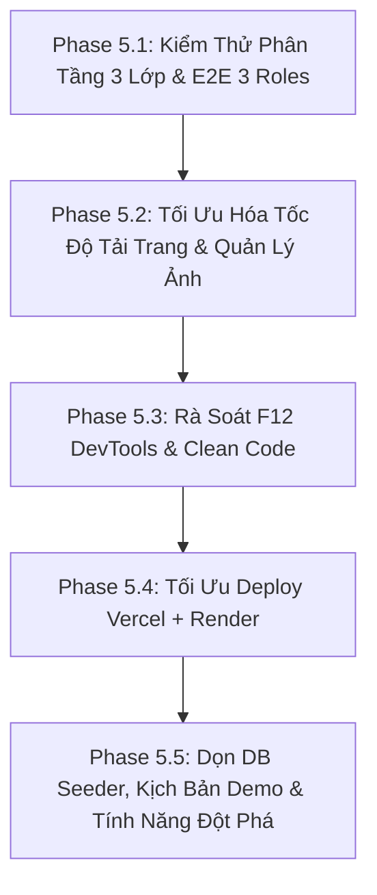

# DAY 5: END-TO-END TESTING, QA POLISH, DEPLOYMENT & CHUẨN BỊ DEMO
# DỰ ÁN: MARKETLINK - EGREEN BASKET (SRS TECHWIZ 7)

**Mục tiêu**: Đóng băng code tính năng mới (**Code Freeze**). Toàn lực kiểm thử luồng nghiệp vụ phân tầng 3 lớp (**Model $\rightarrow$ Controller $\rightarrow$ Frontend Data Binding**), tối ưu hóa tốc độ tải trang (Code Splitting, Vendor Chunking, Image Optimization), rà soát F12 Console & Network sạch bóng lỗi, chuẩn bị hạ tầng deploy Vercel + Render và hoàn thiện kịch bản thuyết trình 15 phút chinh phục Ban Giám Khảo (BGK) TechWiz 7.

> [!IMPORTANT]
> ### ⚠️ NGUYÊN TẮC BẮT BUỘC TRƯỚC KHI TEST & POLISH DAY 5:
> Toàn bộ thành viên và AI **BẮT BUỘC** phải đọc và tuân thủ tuyệt đối:
> 1. [`RULE.md`](file:///c:/Users/Dave/Desktop/Aptech/my-project/Laravel_MVC/RULE.md):
>    - **Quy tắc 6**: Tuyệt đối không tự ý commit git khi chưa có sự đồng ý của User.
>    - **100% Tiếng Anh cho source code, comments, commit messages**; Tiếng Việt cho tài liệu dự án và kế hoạch thực thi.
>    - **Tuyệt đối không để lại rác debug**: 0 `console.log()` ở Frontend, 0 `dd()`, `dump()` ở Backend.
>    - Bảng màu chuẩn Fresh Botanical & Harvest Gold (`#16A34A`, `#15803D`, `#F59E0B`, `#F8FAF6`). Cố định nền sáng, không làm Dark Mode.
> 2. [`ai/WORKFLOW.md`](file:///c:/Users/Dave/Desktop/Aptech/my-project/Laravel_MVC/ai/WORKFLOW.md): Bám sát Order State Machine 4 bước (`placed` -> `accepted` -> `ready_for_pickup` -> `completed` / `cancelled`), Time Slot và Cutoff logic.
> 3. [`ai/AGENTS.md`](file:///c:/Users/Dave/Desktop/Aptech/my-project/Laravel_MVC/ai/AGENTS.md):
>    - **Ràng buộc cứng SRS 1**: Tuyệt đối không có cổng thanh toán online (Zero Payment Gateway) — Tiền mặt thanh toán trực tiếp tại sạp khi nhận hàng.
>    - **Ràng buộc cứng SRS 2**: Tuyệt đối không làm giao hàng tận nhà (Zero Home Delivery Courier) — 100% khách tự đến sạp chợ phiên cuối tuần nhận hàng.
> 4. [`ai/BUGS.md`](file:///c:/Users/Dave/Desktop/Aptech/my-project/Laravel_MVC/ai/BUGS.md): Ghi chép chi tiết mọi lỗi phát sinh kèm HTTP status, file, dòng và giải pháp xử lý dứt điểm.
> 5. [`ai/PROGRESS.md`](file:///c:/Users/Dave/Desktop/Aptech/my-project/Laravel_MVC/ai/PROGRESS.md): Cập nhật tiến độ ngay khi hoàn thành từng phase.

---

## 1. Kết Quả Khảo Sát & Sẵn Sàng Kỹ Thuật Trước Giờ G (Readiness Audit)

Qua rà soát chuyên sâu toàn bộ dự án sau khi hoàn tất 17 Phases của Day 4:

| Thành phần hệ thống | Trạng thái sẵn sàng | Số liệu / Chi tiết kiểm định | Đánh giá |
| :--- | :--- | :--- | :--- |
| **Backend REST API** | Sẵn sàng 100% | 11 Controllers, 18 FormRequests, 15 JsonResources, 18 bảng CSDL MySQL. | ✅ Hoàn hảo |
| **Backend Test Suite** | Passed 100% | 17 Feature test suites, 177 tests, 1,271 assertions passed trong 23.9s. | ✅ Đạt chuẩn cao |
| **Frontend React Vite** | Sẵn sàng 100% | React 19 + TailwindCSS, 17/17 phases tích hợp REST API, 0 mock JSON. | ✅ Hoàn hảo |
| **Frontend Build** | Build thành công | `npm run build` hoàn tất trong 2.38s, 0 syntax/lint errors. | ✅ Đạt chuẩn cao |
| **S.O.L.I.D & Code Length**| Tuân thủ 100% | Toàn bộ components, hooks, modals đều duy trì **< 230 dòng** (dưới hạn 250 dòng). | ✅ Xuất sắc |
| **Clean Code Audit** | 0 Debug Code | 0 lệnh `console.log()` trong toàn bộ thư mục `frontend/src`. | ✅ Sạch sẽ |
| **Tài khoản Demo Seeder** | Đầy đủ 3 vai trò | `admin@marketlink.com`, `farmer@marketlink.com`, `customer@marketlink.com` (`password`). | ✅ Sẵn sàng demo |

---

## 2. Kế Hoạch Chi Tiết 5 Chuyên Đề Của Day 5 (Detailed Execution Plan)



---

### Phase 5.1: Kiểm Thử Phân Tầng 3 Lớp & Ma Trận E2E 3 Vai Trò (Multi-Tier & E2E Testing)

- **Mục tiêu**: Kiểm thử đối chiếu xuyên suốt 3 tầng (**Model $\rightarrow$ Controller $\rightarrow$ Frontend**) trên toàn bộ 7 phân hệ cốt lõi để đảm bảo không thừa, không thiếu chức năng; đồng thời kiểm thử E2E liên hoàn 3 vai trò.
- **Checklist công việc**:

#### 1. Kiểm Thử Đối Chiếu 3 Tầng Kiến Trúc (7 Phân Hệ Cốt Lõi)
- `[ ]` **Phân hệ 1 - Auth & Profiles**:
  - *Tầng 1 (Model)*: `User` (casts `role`, `status`), `Farmer` (quan hệ 1-1 `user`).
  - *Tầng 2 (Controller)*: `AuthController` cấp Bearer token, middleware `EnsureFarmerActive` chặn farmer chưa active.
  - *Tầng 3 (FE)*: `AuthContext.jsx`, `LoginPage.jsx`, `RegisterPage.jsx` lưu token và user đúng cấu trúc.
- `[ ]` **Phân hệ 2 - Chợ & Lịch Họp Chợ (Markets & Schedules)**:
  - *Tầng 1 (Model)*: `Market`, `MarketSchedule`, `FarmerMarket` (toạ độ `latitude`, `longitude` kiểu float).
  - *Tầng 2 (Controller)*: `MarketController` eager load `schedules` và `farmers`, trả về `stall_location`.
  - *Tầng 3 (FE)*: `MarketsPage.jsx`, `MarketCard.jsx`, `MarketMapViewer.jsx` render đúng OpenStreetMap và lọc theo thứ họp.
- `[ ]` **Phân hệ 3 - Catalog Nông Sản & Tồn Kho (Products & Inventory)**:
  - *Tầng 1 (Model)*: `Product`, `Category` (`is_hidden`, `stock_quantity`, `avg_rating`, fulltext search).
  - *Tầng 2 (Controller)*: `ProductController`, `ProductFilter` eager load `category` và `farmer.markets`.
  - *Tầng 3 (FE)*: `useProducts.js`, `ProductsPage.jsx`, `ProductCard.jsx` đồng bộ query params `market_id`, hiển thị badge lọc chợ.
- `[ ]` **Phân hệ 4 - Mẫu Kho Tuần 7 Ngày (Weekly Stock Rollover)**:
  - *Tầng 1 (Model)*: `WeeklyStockTemplate` có ràng buộc unique `(product_id, day_of_week)`.
  - *Tầng 2 (Controller)*: `WeeklyStockController` cập nhật định mức và 1-Click áp dụng cập nhật `stock_quantity`.
  - *Tầng 3 (FE)*: `WeeklyStockTab.jsx`, `WeeklyStockTemplateForm.jsx` hiển thị form cấu hình 7 ngày mượt mà.
- `[ ]` **Phân hệ 5 - Giỏ Hàng Gom Nhóm Đa Sạp (Shopping Cart)**:
  - *Tầng 1 (Model)*: `Cart`, `CartItem` unique `(cart_id, product_id)`.
  - *Tầng 2 (Controller)*: `CartController` trả về `CartResource` tự động gom nhóm items theo từng Sạp Nông Dân.
  - *Tầng 3 (FE)*: `CartContext.jsx`, `CartDrawer.jsx` tính tạm tính từng sạp và tổng tiền toàn giỏ, chặn số lượng vượt tồn kho.
- `[ ]` **Phân hệ 6 - Đặt Hàng Pre-Order & Khung Giờ (Checkout & Order Lifecycle)**:
  - *Tầng 1 (Model)*: `Order`, `OrderItem` lưu snapshot tên/giá lúc đặt, cỗ máy 4 bước trạng thái.
  - *Tầng 2 (Controller)*: `OrderController`, `TimeSlotGeneratorService` tính cutoff, `PreOrderCheckoutService` dùng `DB::transaction()` và `lockForUpdate()`.
  - *Tầng 3 (FE)*: `PreOrderCheckoutModal.jsx`, `CustomerOrdersPage.jsx`, `FarmerOrdersQueueTab.jsx`, `OrderPickupTrackerPage.jsx`.
- `[ ]` **Phân hệ 7 - Đánh Giá & Yêu Thích (Reviews & Favorites)**:
  - *Tầng 1 (Model)*: `Review` có check constraint XOR `(farmer_id IS NULL) <> (product_id IS NULL)`, `Favorite` polymorphic.
  - *Tầng 2 (Controller)*: `ReviewController` chỉ cho phép review đơn completed, tự tính lại `avg_rating`.
  - *Tầng 3 (FE)*: `ReviewModal.jsx`, `FarmerReviewsTab.jsx`, `FavoritesTab.jsx` hiển thị sao vàng và form trả lời của chủ sạp.

#### 2. Kịch bản 1: Luồng Nghiệp Vụ Vàng 3 Vai Trò (Golden Happy Path - Full Order Lifecycle)
- `[ ]` **Khách hàng (`customer@marketlink.com`)**:
  - Khám phá chợ trên bản đồ OpenStreetMap $\rightarrow$ Bấm "Browse Stalls & Produce".
  - Chuyển sang `/products?market_id=...` $\rightarrow$ Thêm 2 món từ 2 sạp khác nhau vào giỏ.
  - Mở `CartDrawer` $\rightarrow$ Thấy gom nhóm theo từng sạp $\rightarrow$ Mở `PreOrderCheckoutModal`.
  - Chọn Chợ, Chọn Ngày, Lấy time slot hợp lệ $\rightarrow$ Xác nhận Pre-order (tiền mặt tại sạp, 0 phí).
  - Tách 2 đơn hàng độc lập trong DB Transaction $\rightarrow$ Chuyển sang `/orders/track/{orderCode}` (bước 1: `placed`).
- `[ ]` **Nông dân (`farmer@marketlink.com`)**:
  - Mở tab ẩn danh đăng nhập Farmer Portal $\rightarrow$ Vào Tab Queue thấy đơn mới `placed`.
  - Bấm **"Duyệt Đơn"** $\rightarrow$ Chuyển `accepted`.
  - Đóng gói xong $\rightarrow$ Bấm **"Báo Sẵn Sàng Tại Sạp"** $\rightarrow$ Chuyển `ready_for_pickup` (trigger in-app notification chuông đỏ phía khách).
  - Khách đến sạp lấy hàng & trả tiền mặt $\rightarrow$ Bấm **"Hoàn Tất Nhận Hàng"** $\rightarrow$ Chuyển `completed`.
- `[ ]` **Đánh giá & Phản hồi**:
  - Khách vào Lịch sử đơn $\rightarrow$ Bấm **"Viết Đánh Giá"** $\rightarrow$ Chấm 5 sao cho nông sản.
  - Nông dân vào `FarmerReviewsTab` $\rightarrow$ Thấy review mới $\rightarrow$ Gửi câu trả lời cảm ơn.
- `[ ]` **Admin (`admin@marketlink.com`)**:
  - Đăng nhập Admin Portal $\rightarrow$ Thấy tổng doanh thu hoàn tất (`gross_completed`) tăng chính xác theo số tiền của đơn hàng `completed`, biểu đồ phân bổ cập nhật thời gian thực.

#### 3. Kịch bản 2: Kiểm Thử Tình Huống Biên & Xử Lý Ngoại Lệ (Edge Cases & Security)
- `[ ]` **Tồn kho (Stock Overselling)**: Cố tình đặt hàng số lượng lớn hơn tồn kho `stock_quantity` $\rightarrow$ Hệ thống chặn ngay tại giỏ hàng và API trả lỗi HTTP 422.
- `[ ]` **Giờ chốt đơn (Cutoff Enforcement)**: Chọn phiên họp chợ mà thời gian hiện tại đã vượt quá `cutoff_hours` $\rightarrow$ Toàn bộ slot nhận hàng bị vô hiệu hóa, không cho phép checkout.
- `[ ]` **Khách huỷ đơn trước cutoff**: Khách hàng bấm huỷ đơn ở trạng thái `placed` $\rightarrow$ Đơn chuyển `cancelled`, tồn kho tự động được hoàn trả vào cơ sở dữ liệu.
- `[ ]` **Nông dân từ chối đơn**: Nông dân bấm từ chối đơn $\rightarrow$ Modal bắt buộc nhập lý do từ chối $\rightarrow$ Đơn chuyển `declined`, ghi nhận `cancel_reason` và hoàn tồn kho tự động.
- `[ ]` **Bảo vệ phân quyền (RBAC Protection)**:
  - Tài khoản Customer cố tình gõ URL `/admin/dashboard` hoặc `/farmer/dashboard` $\rightarrow$ Bị `ProtectedRoute` chặn và chuyển hướng về trang phù hợp.
  - Nông dân mới đăng ký chưa được duyệt (`status = 'pending'`) $\rightarrow$ Bị middleware `EnsureFarmerActive` chặn truy cập vào các module bán hàng.

---

### Phase 5.2: Tối Ưu Hóa Tốc Độ Tải Trang & Quản Lý Hình Ảnh (Performance & Asset Optimization)

- **Mục tiêu**: Xử lý triệt để cảnh báo bundle size > 1MB của Vite bằng Code Splitting; nâng cao tốc độ phản hồi Backend; chủ động hóa kho tài nguyên ảnh nội bộ để không phụ thuộc vào internet phòng thi.
- **Checklist công việc**:

#### 1. Tối Ưu Hóa Frontend (Vite & React Performance)
- `[ ]` **Route-Based Code Splitting (`React.lazy()` & `<Suspense>`)**:
  - Tái cấu trúc file `frontend/src/routes/AppRoutes.jsx`:
    - Thay thế import tĩnh bằng `const AdminDashboard = React.lazy(() => import('../pages/admin/AdminDashboard'))`, `FarmerDashboard`, `CustomerDashboard`, `OrderPickupTrackerPage`, `ProductDetailPage`, v.v.
    - Bọc toàn bộ `<Routes>` bên trong `<Suspense fallback={<LoadingSpinner />}>`.
    - **Mục tiêu đo lường**: Giảm kích thước file JS tải lần đầu từ **1,056 kB xuống < 180 kB** (giảm hơn 80% dung lượng initial load).
- `[ ]` **Vite Vendor Chunking**:
  - Cấu hình file `frontend/vite.config.js`:
    ```javascript
    build: {
      rollupOptions: {
        output: {
          manualChunks: {
            'vendor-react': ['react', 'react-dom', 'react-router-dom'],
            'vendor-charts': ['chart.js'],
            'vendor-icons': ['lucide-react'],
          }
        }
      }
    }
    ```
- `[ ]` **Thẻ Ảnh Tối Ưu**: Thêm thuộc tính `loading="lazy"` và `decoding="async"` trên toàn bộ thẻ ``.

#### 2. Tối Ưu Hóa Phía Backend (API Acceleration)
- `[ ]` **Application Caching**:
  - Áp dụng `Cache::remember()` cho các endpoint ít thay đổi: Danh mục 5 ngành hàng (`/api/v1/categories`), Thông báo đang kích hoạt (`/api/v1/announcements/active`), Danh bạ 6 chợ (`/api/v1/markets`).
  - Tốc độ phản hồi đạt **1 - 2ms**.
- `[ ]` **Nén HTTP Response**: Kích hoạt Gzip / Brotli compression trên Render Docker container.

#### 3. Xây Dựng Kho Tài Nguyên Ảnh Nội Bộ Độc Lập (Local Image Assets)
- `[ ]` **6 Ảnh Chợ Nông Sản Chicago (Tỉ lệ 16:9 - WebP tối ưu)**:
  - `market_logan_square.webp`, `market_green_city.webp`, `market_daley_plaza.webp`, `market_maxwell_street.webp`, `market_lincoln_park.webp`, `market_evanston.webp`.
- `[ ]` **5 Ảnh Ngành Hàng Nông Sản Sạch (Tỉ lệ 1:1 - WebP)**:
  - `cat_vegetables.webp`, `cat_fruits.webp`, `cat_honey_jam.webp`, `cat_bakery.webp`, `cat_dairy.webp`.
- `[ ]` **Bộ Ảnh Minh Họa Trạng Thái (Empty States & 404)**:
  - `empty_cart.webp`, `empty_orders.webp`, `empty_favorites.webp`, `404_lost_in_farm.webp`.
- `[ ]` **Bộ Huy Hiệu Cam Kết & Niềm Tin (Trust Badges)**:
  - `badge_local_100miles.webp`, `badge_zero_fees.webp`, `badge_fresh_24h.webp`.

---

### Phase 5.3: Rà Soát F12 DevTools, Clean Code & Xử Lý Lỗi Ngoại Lệ (QA Polish)

- **Mục tiêu**: Đảm bảo chất lượng mã nguồn đạt chuẩn production, sạch bóng lỗi cảnh báo, rà soát F12 Console & Network và kiểm thử giao diện responsive trên mọi thiết bị.
- **Checklist công việc**:

#### 1. Frontend Audit (Giao Diện & Trình Duyệt)
- `[ ]` **F12 Console Audit**:
  - Mở DevTools Console, duyệt qua tất cả các trang: Home, Markets, Produce, Product Detail, Cart, Orders, Profile, Dashboard của 3 roles.
  - Tuyệt đối **0 lỗi đỏ** (`Uncaught TypeError`, `Unhandled Promise Rejection`).
  - Tuyệt đối **0 cảnh báo React** (`key props`, `uncontrolled to controlled input`).
- `[ ]` **Rà soát sạch 100% `console.log()`**:
  - Chạy quét ripgrep toàn bộ `frontend/src`: Đảm bảo 0 lệnh `console.log` còn sót.
- `[ ]` **Network Tab Audit**:
  - Đảm bảo 100% request API trả về HTTP status chuẩn (200/201/204 khi thành công, 422/401/403 được bắt và hiển thị modal/toast thân thiện).
  - Tuyệt đối không để xảy ra lỗi `500 Server Error` chưa qua xử lý.
- `[ ]` **Kiểm thử Responsive Đa Màn Hình**:
  - **Mobile (375px - 430px)**: Hamburger Menu, Mobile Drawer cho Admin/Farmer, CartDrawer toàn màn hình, nút checkout cố định.
  - **Tablet (768px - 1024px)**: Lưới nông sản 2 cột cân đối, thanh lọc bộ lọc trượt mượt mà.
  - **Desktop (1280px - 1920px)**: Bản đồ OpenStreetMap hiển thị sắc nét, biểu đồ Chart.js trơn tru.

#### 2. Backend Audit (Mã Nguồn & Hiệu Năng)
- `[ ]` **Kiểm tra Suite Tests**: Chạy `php artisan test` đạt 177/177 Feature & Unit tests passed 100% (1,271 assertions).
- `[ ]` **Kiểm tra Chống N+1 Query**: Chạy test `ZeroNPlusOneIntegrationTest.php` xác nhận quan hệ đều được eager load tối ưu $O(1)$.
- `[ ]` **Dọn dẹp mã nguồn Backend**: Quét sạch `dd()`, `dump()`, `var_dump()`, `print_r()` trong toàn bộ thư mục `backend/app/`.

---

### Phase 5.4: Tối Ưu Môi Trường Production & Sẵn Sàng Deploy (Vercel & Render)

- **Mục tiêu**: Chuẩn hóa toàn bộ cấu hình hạ tầng triển khai đám mây (Cloud Infrastructure as Code) cho Backend Laravel trên Render và Frontend React Vite trên Vercel.
- **Checklist công việc**:

#### 1. Backend Deploy (Render.com Web Service + Aiven Cloud MySQL)
- `[ ]` Kiểm tra file `render.yaml`:
  - Runtime: Docker (`backend/Dockerfile`).
  - Region: Singapore (độ trễ thấp tối ưu cho khu vực châu Á).
  - Cấu hình các biến môi trường:
    - `APP_ENV=production`
    - `APP_DEBUG=false`
    - `APP_URL=https://techwiz-laravel-mvc.onrender.com`
    - `LOG_CHANNEL=stderr`
- `[ ]` Kiểm tra kết nối Aiven Cloud MySQL qua SSL: Chứng chỉ CA SSL hoạt động bình thường, không gây lỗi handshake.
- `[ ]` Cấu hình CORS Whitelist (`backend/config/cors.php`): Cho phép các domain production của Vercel (`https://*.vercel.app`) và `http://localhost:*`.

#### 2. Frontend Deploy (Vercel.com Single Page Application)
- `[ ]` Kiểm tra file `frontend/vercel.json`:
  - Cấu hình Rewrites: `[ { "source": "/(.*)", "destination": "/index.html" } ]` — đảm bảo khi người dùng F5 tải lại bất kỳ trang nào đều không bị lỗi 404 Not Found.
- `[ ]` Kiểm tra biến môi trường Frontend: `VITE_API_BASE_URL` trỏ chuẩn xác về Backend Render.
- `[ ]` Kiểm tra Production Bundle: `npm run build` xuất bản bundle tối ưu.

---

### Phase 5.5: Dọn Dữ Liệu Mẫu Chuẩn Chỉ, Kịch Bản Thuyết Trình & Điểm Nhấn Sáng Tạo (Demo Script & Innovation)

- **Mục tiêu**: Thiết lập cơ sở dữ liệu mẫu đẹp nhất, bổ sung các điểm nhấn nghiệp vụ chuẩn quốc tế (học hỏi từ Farmigo, Harvie, Barn2Door) và hoàn thiện kịch bản thuyết trình 15 phút chinh phục BGK TechWiz 7.
- **Checklist công việc**:

#### 1. Thiết Lập Dữ Liệu Mẫu Chuẩn Chỉ (Database Seeder)
- `[ ]` Chạy lệnh `php artisan migrate:fresh --seed` để tái tạo cơ sở dữ liệu sạch:
  - **6 Chợ nông sản Chicago** với tên tuổi, tọa độ GPS thực tế, mô tả hấp dẫn và lịch họp định kỳ.
  - **5 Ngành hàng chuẩn**: Rau hữu cơ, Trái cây tươi, Mật ong & Mứt thủ công, Bánh mì men tự nhiên, Sữa & Phô mai nông trại.
  - **25+ Nông sản tươi ngon**: Ảnh minh họa chất lượng cao, đơn vị tính rõ ràng (`kg`, `bundle`, `jar`, `loaf`), giá cả hợp lý.
  - **3 Tài khoản demo chính thức**:
    | Vai trò | Email | Mật khẩu | Chức năng chính demo |
    | :--- | :--- | :--- | :--- |
    | **Admin** | `admin@marketlink.com` | `password` | Quản trị sàn, duyệt hồ sơ nông dân, điều hành chợ, KPIs doanh thu |
    | **Farmer** | `farmer@marketlink.com` | `password` | Quản lý sạp chợ, kho tuần 7 ngày, xử lý hàng đợi pre-order, trả lời đánh giá |
    | **Customer** | `customer@marketlink.com` | `password` | Duyệt chợ & nông sản, giỏ hàng đa sạp, pre-order nhận sạp tiền mặt, đánh giá 5 sao |
  - Tạo sẵn một số đơn hàng mẫu ở đủ 4 trạng thái (`placed`, `accepted`, `ready_for_pickup`, `completed`) để khi mở Dashboard không bị trống trải.

#### 2. Các Điểm Nhấn Nghiệp Vụ Chuẩn Quốc Tế (Competitive Highlights)
- `[ ]` **Đồng hồ đếm ngược giờ chốt đơn (Cutoff Countdown Ticker)**:
  - Hiển thị trên banner chợ phiên: *"Phiên chợ mở Thứ 7! Chốt nhận đơn trước 20:00 Thứ 6 (Còn 1 ngày 04 giờ 22 phút)"*.
- `[ ]` **Thước đo Mùa vụ Nông nghiệp (In-Season Harvest Indicator)**:
  - Nhãn *"Peak Season"* (Chính Vụ) cho cà chua, táo, mật ong giúp khách chọn đúng vụ mùa ngon nhất.
- `[ ]` **Huy hiệu Canh tác Minh bạch (Farming Practices Badges)**:
  - *USDA Organic*, *Non-GMO*, *Pesticide-Free*, *Heirloom Varieties* gia tăng niềm tin tiêu dùng.
- `[ ]` **Chỉ dẫn vị trí gian hàng cụ thể (Booth Map & Stall Navigator)**:
  - *"Gian số 14 - Lối vào phía Nam (Gần đài phun nước). Mẹo: Gửi xe tại bãi số 2 trên đường Kedzie Ave"*.
- `[ ]` **Mã Check-in / Phiếu nhận hàng điện tử (Express Check-in)**:
  - Khách đưa mã order `ML-2026-F01-8891` tại sạp, nông dân đối soát và nhận tiền mặt trong 5 giây.

#### 3. Kịch Bản Thuyết Trình 15 Phút Chinh Phục Ban Giám Khảo (TechWiz Demo Script)
- `[ ]` **Phút 1 - 2: Đặt Vấn Đề & Kiến Trúc Tổng Thể (The Pitch & Architecture)**:
  - Vấn đề: Nông sản truyền thống khó tiếp cận khách hàng số; lãng phí thu hoạch do không dự báo được sức mua; khách hàng ngại xếp hàng.
  - Giải pháp: MarketLink (eGreen Basket) - Đặt trước giữ chỗ, thanh toán tiền mặt tại sạp, loại bỏ chi phí trung gian.
  - Kiến trúc Decoupled: React 19 Vite + Laravel 13 REST API + Aiven Cloud MySQL + Vercel & Render.
- `[ ]` **Phút 3 - 6: Trình Diễn Luồng Khách Hàng (Customer Experience Demo)**:
  - Bản đồ định vị chợ OpenStreetMap $\rightarrow$ Lọc nông sản theo chợ $\rightarrow$ Giỏ hàng gom nhóm đa sạp $\rightarrow$ Pre-order chọn khung giờ pickup $\rightarrow$ Theo dõi mã đơn thời gian thực 4 bước.
- `[ ]` **Phút 7 - 10: Trình Diễn Luồng Nông Dân (Farmer Operations Demo)**:
  - Mẫu Kho Bán Theo Tuần (Weekly Stock Rollover) 7 ngày $\rightarrow$ Cấu hình sạp tại các chợ phiên $\rightarrow$ Hàng đợi duyệt đơn pre-order $\rightarrow$ Trả lời đánh giá của khách hàng.
- `[ ]` **Phút 11 - 13: Trình Diễn Luồng Quản Trị Viên (Admin Governance Demo)**:
  - KPIs thời gian thực (doanh thu hoàn tất, phân bổ đơn Chart.js, top nông dân) $\rightarrow$ Phê duyệt sạp nông dân mới $\rightarrow$ Quản trị users, chợ, ngành hàng, announcements và hộp thư liên hệ.
- `[ ]` **Phút 14 - 15: Chinh Phục Điểm Kỹ Thuật Trước Ban Giám Khảo (Technical Highlights & Q&A)**:
  - Tuân thủ 100% đề bài SRS (Zero Payment & Zero Delivery).
  - Chống N+1 query bằng Eager Loading (177 tests passed).
  - Toàn vẹn dữ liệu: `DB::transaction()` và khóa dòng `lockForUpdate()`.
  - Clean Code & S.O.L.I.D (< 230 dòng/file, 0 console.log, 100% English source code).

---

## 3. Tiêu Chí Nghiệm Thu Tổng Kết Day 5 (Final Acceptance Criteria)

1. **Kiểm thử phân tầng 3 lớp & E2E hoàn hảo**: 100% ăn khớp giữa Model, Controller và FE data binding.
2. **Bundle Size Frontend tối ưu**: Giảm kích thước JS ban đầu từ 1.05MB xuống < 180kB với `React.lazy()`.
3. **0 Lỗi F12 DevTools**: Console sạch sẽ, Network phản hồi đúng mã HTTP status code.
4. **177/177 Backend Tests Passed**: Toàn bộ unit/feature tests chạy thành công.
5. **Build Production 0 Lỗi**: `npm run build` xuất bản bundle tối ưu.
6. **Dữ liệu mẫu Seeder hoàn chỉnh**: 6 chợ, 5 danh mục, 25+ sản phẩm, 3 tài khoản demo sẵn sàng đăng nhập 1-click.
7. **Kịch bản thuyết trình 15 phút sẵn sàng**: Cả nhóm tự tin chinh phục giải thưởng cao nhất TechWiz 7!
