# SƠ ĐỒ THIẾT KẾ CƠ SỞ DỮ LIỆU (ERD) & DATA DICTIONARY
# DỰ ÁN: MARKETLINK - EGREEN BASKET PORTAL
# CHUẨN HOÁ: 18 BẢNG QUAN HỆ (MYSQL 8.0+ / AIVEN CLOUD)

Tài liệu này cung cấp sơ đồ thực thể quan hệ Entity-Relationship Diagram (ERD) hoàn chỉnh và từ điển dữ liệu (Data Dictionary) chi tiết cho toàn bộ 18 bảng của hệ thống **MarketLink**.

---

## 1. SƠ ĐỒ THỰC THỂ QUAN HỆ (MERMAID ERD DIAGRAM)

```mermaid
erDiagram
    users ||--o{ personal_access_tokens : "has tokens"
    users ||--o| farmers : "owns stall profile (1-1)"
    users ||--o{ carts : "owns cart (1-1)"
    users ||--o{ orders : "places orders as customer"
    users ||--o{ favorites : "marks favorites"
    users ||--o{ reviews : "writes reviews as customer"
    users ||--o{ notifications : "receives in-app notifications"
    users ||--o{ announcements : "creates announcements as admin"
    users ||--o{ contact_messages : "submits contact inquiries"

    markets ||--o{ market_schedules : "has operating schedules"
    markets ||--o{ farmer_markets : "hosts farmer stalls"
    markets ||--o{ orders : "serves as pickup location"

    farmers ||--o{ farmer_markets : "sells at markets"
    farmers ||--o{ products : "lists farm products"
    farmers ||--o{ orders : "fulfills incoming orders"
    farmers ||--o{ reviews : "receives farmer-level reviews"

    categories ||--o{ products : "classifies products"

    products ||--o{ weekly_stock_templates : "has recurring weekly templates"
    products ||--o{ cart_items : "added into carts"
    products ||--o{ order_items : "purchased via pre-orders"
    products ||--o{ reviews : "receives product-level reviews"

    carts ||--o{ cart_items : "contains selected items"

    orders ||--o{ order_items : "contains purchased item snapshots"
    orders ||--o{ reviews : "verified against completed orders"
    orders ||--o{ notifications : "triggers order status alerts"

    users {
        bigint id PK
        varchar fullname
        varchar username UK
        varchar email UK
        varchar phone
        text address
        enum role "admin,farmer,customer"
        enum status "pending,active,inactive,banned"
        timestamp email_verified_at
        varchar password
        varchar remember_token
        timestamp created_at
        timestamp updated_at
        timestamp deleted_at
    }

    personal_access_tokens {
        bigint id PK
        varchar tokenable_type
        bigint tokenable_id
        varchar name
        varchar token UK
        text abilities
        timestamp last_used_at
        timestamp expires_at
        timestamp created_at
        timestamp updated_at
    }

    markets {
        bigint id PK
        varchar name
        text address
        decimal latitude
        decimal longitude
        varchar map_provider
        text map_embed_url
        text description
        varchar image
        enum status "active,inactive"
        timestamp created_at
        timestamp updated_at
        timestamp deleted_at
    }

    market_schedules {
        bigint id PK
        bigint market_id FK
        tinyint day_of_week "0=Sun...6=Sat"
        time open_time
        time close_time
    }

    farmers {
        bigint id PK
        bigint user_id FK "UNIQUE"
        varchar stall_name
        varchar contact_person
        varchar contact_phone
        text address
        decimal latitude
        decimal longitude
        text description
        varchar logo
        decimal avg_rating
        int review_count
        timestamp created_at
        timestamp updated_at
        timestamp deleted_at
    }

    farmer_markets {
        bigint id PK
        bigint farmer_id FK
        bigint market_id FK
        varchar stall_location
        json pickup_days
        time pickup_start_time
        time pickup_end_time
        smallint slot_minutes
        smallint cutoff_hours
        tinyint is_active
        timestamp created_at
        timestamp updated_at
    }

    categories {
        bigint id PK
        varchar name UK
        varchar slug UK
        text description
        tinyint is_active
        timestamp created_at
        timestamp updated_at
    }

    products {
        bigint id PK
        bigint farmer_id FK
        bigint category_id FK
        varchar name
        text description
        decimal price
        varchar unit
        decimal stock_quantity
        enum availability "available,sold_out,unavailable"
        varchar image
        tinyint is_hidden
        decimal avg_rating
        int review_count
        timestamp created_at
        timestamp updated_at
        timestamp deleted_at
    }

    weekly_stock_templates {
        bigint id PK
        bigint product_id FK
        tinyint day_of_week "0..6"
        decimal default_quantity
        tinyint is_active
    }

    carts {
        bigint id PK
        bigint user_id FK "UNIQUE"
        timestamp created_at
        timestamp updated_at
    }

    cart_items {
        bigint id PK
        bigint cart_id FK
        bigint product_id FK
        decimal quantity
        timestamp created_at
        timestamp updated_at
    }

    orders {
        bigint id PK
        varchar order_code UK
        bigint customer_id FK
        bigint farmer_id FK
        bigint market_id FK
        date pickup_date
        time pickup_start_time
        time pickup_end_time
        enum status "placed,accepted,declined,ready_for_pickup,completed,cancelled"
        decimal total_amount
        text note
        varchar cancel_reason
        datetime cutoff_at
        datetime accepted_at
        datetime ready_at
        datetime completed_at
        datetime cancelled_at
        timestamp created_at
        timestamp updated_at
    }

    order_items {
        bigint id PK
        bigint order_id FK
        bigint product_id FK
        varchar product_name
        varchar unit
        decimal unit_price
        decimal quantity
        decimal subtotal
    }

    favorites {
        bigint id PK
        bigint user_id FK
        enum favoritable_type "farmer,product,market"
        bigint favoritable_id
        timestamp created_at
    }

    reviews {
        bigint id PK
        bigint customer_id FK
        bigint order_id FK
        bigint farmer_id FK "Nullable"
        bigint product_id FK "Nullable"
        tinyint rating "1..5"
        text comment
        text farmer_reply
        timestamp farmer_replied_at
        tinyint is_hidden
        timestamp created_at
        timestamp updated_at
        timestamp deleted_at
    }

    notifications {
        bigint id PK
        bigint user_id FK
        varchar type
        varchar title
        text message
        bigint order_id FK "Nullable"
        tinyint is_read
        timestamp created_at
    }

    announcements {
        bigint id PK
        bigint created_by FK
        varchar title
        text content
        enum target_role "all,farmer,customer"
        tinyint is_active
        timestamp created_at
        timestamp updated_at
    }

    contact_messages {
        bigint id PK
        varchar name
        varchar email
        varchar subject
        text message
        tinyint is_read
        timestamp created_at
        timestamp updated_at
    }
```

---

## 2. TỪ ĐIỂN DỮ LIỆU CHI TIẾT (DATA DICTIONARY)

### Bảng 1: `users`
Lưu trữ toàn bộ người dùng hệ thống gồm Quản trị viên, Nông dân và Khách hàng.
| Tên cột | Kiểu dữ liệu | Null | Mặc định | Ràng buộc / Ý nghĩa |
| :--- | :--- | :---: | :--- | :--- |
| `id` | `BIGINT UNSIGNED` | NO | AUTO_INCREMENT | Khóa chính (Primary Key) |
| `fullname` | `VARCHAR(100)` | NO | | Họ và tên đầy đủ |
| `username` | `VARCHAR(50)` | NO | | UNIQUE - Tên đăng nhập duy nhất |
| `email` | `VARCHAR(100)` | NO | | UNIQUE - Địa chỉ email định danh |
| `phone` | `VARCHAR(20)` | YES | NULL | SĐT (Bắt buộc nhập đối với Customer ở tầng FormRequest) |
| `address` | `TEXT` | YES | NULL | Địa chỉ (Bắt buộc nhập đối với Customer ở tầng FormRequest) |
| `role` | `ENUM` | NO | `'customer'` | `'admin'`, `'farmer'`, `'customer'` |
| `status` | `ENUM` | NO | `'active'` | `'pending'`, `'active'`, `'inactive'`, `'banned'` |
| `email_verified_at` | `TIMESTAMP` | YES | NULL | Thời điểm xác minh email |
| `password` | `VARCHAR(255)` | NO | | Mật khẩu băm Bcrypt / Argon2ID |
| `remember_token` | `VARCHAR(100)` | YES | NULL | Token ghi nhớ đăng nhập Web |
| `created_at` | `TIMESTAMP` | YES | NULL | Thời gian tạo tài khoản |
| `updated_at` | `TIMESTAMP` | YES | NULL | Thời gian cập nhật gần nhất |
| `deleted_at` | `TIMESTAMP` | YES | NULL | Soft Delete (Xóa mềm) |
- **Indexes**: `INDEX (role, status)`.

---

### Bảng 2: `personal_access_tokens` (Laravel Sanctum)
Quản lý Bearer Token cho xác thực API giữa React Frontend và Laravel Backend.
| Tên cột | Kiểu dữ liệu | Null | Mặc định | Ràng buộc / Ý nghĩa |
| :--- | :--- | :---: | :--- | :--- |
| `id` | `BIGINT UNSIGNED` | NO | AUTO_INCREMENT | PK |
| `tokenable_type` | `VARCHAR(255)` | NO | | Morph type (App\Models\User) |
| `tokenable_id` | `BIGINT UNSIGNED` | NO | | Morph ID (users.id) |
| `name` | `VARCHAR(255)` | NO | | Tên token (VD: 'auth-token') |
| `token` | `VARCHAR(64)` | NO | | UNIQUE - Mã hash SHA-256 của token |
| `abilities` | `TEXT` | YES | NULL | Quyền hạn token (JSON/Wildcard) |
| `last_used_at` | `TIMESTAMP` | YES | NULL | Lần sử dụng gần nhất |
| `expires_at` | `TIMESTAMP` | YES | NULL | Thời điểm hết hạn |
| `created_at` | `TIMESTAMP` | YES | NULL | |
| `updated_at` | `TIMESTAMP` | YES | NULL | |
- **Indexes**: `INDEX (tokenable_type, tokenable_id)`.

---

### Bảng 3: `markets`
Danh bạ các chợ nông dân địa phương và tọa độ vị trí thực tế trên bản đồ.
| Tên cột | Kiểu dữ liệu | Null | Mặc định | Ràng buộc / Ý nghĩa |
| :--- | :--- | :---: | :--- | :--- |
| `id` | `BIGINT UNSIGNED` | NO | AUTO_INCREMENT | PK |
| `name` | `VARCHAR(100)` | NO | | Tên chợ nông dân |
| `address` | `TEXT` | NO | | Địa chỉ thực tế |
| `latitude` | `DECIMAL(10,8)` | NO | | Vĩ độ bản đồ |
| `longitude` | `DECIMAL(11,8)` | NO | | Kinh độ bản đồ |
| `map_provider` | `VARCHAR(30)` | NO | `'osm'` | Bộ cung cấp bản đồ ('osm', 'google') |
| `map_embed_url` | `TEXT` | YES | NULL | URL iframe nhúng bản đồ |
| `description` | `TEXT` | YES | NULL | Giới thiệu về quy mô chợ |
| `image` | `VARCHAR(255)` | YES | NULL | URL hình ảnh đại diện chợ |
| `status` | `ENUM` | NO | `'active'` | `'active'`, `'inactive'` |
| `created_at` | `TIMESTAMP` | YES | NULL | |
| `updated_at` | `TIMESTAMP` | YES | NULL | |
| `deleted_at` | `TIMESTAMP` | YES | NULL | Soft Delete |
- **Indexes**: `INDEX (status)`, `INDEX (latitude, longitude)`.

---

### Bảng 4: `market_schedules`
Lịch mở cửa họp chợ theo từng ngày trong tuần.
| Tên cột | Kiểu dữ liệu | Null | Mặc định | Ràng buộc / Ý nghĩa |
| :--- | :--- | :---: | :--- | :--- |
| `id` | `BIGINT UNSIGNED` | NO | AUTO_INCREMENT | PK |
| `market_id` | `BIGINT UNSIGNED` | NO | | FK -> `markets.id` ON DELETE CASCADE |
| `day_of_week` | `TINYINT UNSIGNED` | NO | | 0 = Chủ nhật, 1 = T2, ..., 6 = Thứ 7 |
| `open_time` | `TIME` | NO | | Giờ mở cửa chợ |
| `close_time` | `TIME` | NO | | Giờ đóng cửa chợ |
- **Ràng buộc**: `UNIQUE (market_id, day_of_week)`, `CHECK (open_time < close_time)`.

---

### Bảng 5: `farmers`
Hồ sơ gian hàng và thông tin liên hệ đại diện của chủ sạp nông dân (1-1 với `users`).
| Tên cột | Kiểu dữ liệu | Null | Mặc định | Ràng buộc / Ý nghĩa |
| :--- | :--- | :---: | :--- | :--- |
| `id` | `BIGINT UNSIGNED` | NO | AUTO_INCREMENT | PK |
| `user_id` | `BIGINT UNSIGNED` | NO | | FK -> `users.id` ON DELETE CASCADE, UNIQUE |
| `stall_name` | `VARCHAR(100)` | NO | | Tên sạp nông sản |
| `contact_person` | `VARCHAR(100)` | NO | | Tên người đại diện bán hàng |
| `contact_phone` | `VARCHAR(20)` | NO | | Số điện thoại liên hệ sạp |
| `address` | `TEXT` | NO | | Địa chỉ trang trại gốc |
| `latitude` | `DECIMAL(10,8)` | YES | NULL | Toạ độ trang trại (tuỳ chọn) |
| `longitude` | `DECIMAL(11,8)` | YES | NULL | Toạ độ trang trại (tuỳ chọn) |
| `description` | `TEXT` | YES | NULL | Giới thiệu kỹ thuật canh tác |
| `logo` | `VARCHAR(255)` | YES | NULL | URL logo/ảnh đại diện sạp |
| `avg_rating` | `DECIMAL(3,2)` | NO | `0.00` | Điểm đánh giá trung bình (1.00 - 5.00) |
| `review_count` | `INT UNSIGNED` | NO | `0` | Tổng số lượng đánh giá sạp nhận được |
| `created_at` | `TIMESTAMP` | YES | NULL | |
| `updated_at` | `TIMESTAMP` | YES | NULL | |
| `deleted_at` | `TIMESTAMP` | YES | NULL | Soft Delete |

---

### Bảng 6: `farmer_markets`
Liên kết Nông dân với Chợ bán thực tế, quy định vị trí sạp và khung giờ nhận hàng.
| Tên cột | Kiểu dữ liệu | Null | Mặc định | Ràng buộc / Ý nghĩa |
| :--- | :--- | :---: | :--- | :--- |
| `id` | `BIGINT UNSIGNED` | NO | AUTO_INCREMENT | PK |
| `farmer_id` | `BIGINT UNSIGNED` | NO | | FK -> `farmers.id` ON DELETE CASCADE |
| `market_id` | `BIGINT UNSIGNED` | NO | | FK -> `markets.id` ON DELETE CASCADE |
| `stall_location` | `VARCHAR(150)` | YES | NULL | Vị trí gian (VD: 'Gian C15, Khu Rau Quả') |
| `pickup_days` | `JSON` | NO | | Mảng thứ nhận hàng, VD: `[6, 0]` |
| `pickup_start_time` | `TIME` | NO | | Giờ bắt đầu đón khách nhận hàng |
| `pickup_end_time` | `TIME` | NO | | Giờ kết thúc đón khách nhận hàng |
| `slot_minutes` | `SMALLINT UNSIGNED`| NO | `30` | Bước nhảy mỗi khung giờ (phút) |
| `cutoff_hours` | `SMALLINT UNSIGNED`| NO | `12` | Số tiếng chốt đơn trước giờ pickup |
| `is_active` | `TINYINT(1)` | NO | `1` | Trạng thái hoạt động tại chợ này |
| `created_at` | `TIMESTAMP` | YES | NULL | |
| `updated_at` | `TIMESTAMP` | YES | NULL | |
- **Ràng buộc**: `UNIQUE (farmer_id, market_id)`, `CHECK (pickup_start_time < pickup_end_time)`.
- **Indexes**: `INDEX (market_id)`.

---

### Bảng 7: `categories`
Phân loại ngành hàng nông sản (Rau ăn lá, Trái cây, Trứng sữa, Bánh mộc...).
| Tên cột | Kiểu dữ liệu | Null | Mặc định | Ràng buộc / Ý nghĩa |
| :--- | :--- | :---: | :--- | :--- |
| `id` | `BIGINT UNSIGNED` | NO | AUTO_INCREMENT | PK |
| `name` | `VARCHAR(100)` | NO | | UNIQUE - Tên ngành hàng |
| `slug` | `VARCHAR(120)` | NO | | UNIQUE - URL slug thân thiện |
| `description` | `TEXT` | YES | NULL | Mô tả phân loại |
| `is_active` | `TINYINT(1)` | NO | `1` | Trạng thái kích hoạt |
| `created_at` | `TIMESTAMP` | YES | NULL | |
| `updated_at` | `TIMESTAMP` | YES | NULL | |

---

### Bảng 8: `products`
Danh sách sản phẩm nông sản tươi sạch do nông dân niêm yết bán.
| Tên cột | Kiểu dữ liệu | Null | Mặc định | Ràng buộc / Ý nghĩa |
| :--- | :--- | :---: | :--- | :--- |
| `id` | `BIGINT UNSIGNED` | NO | AUTO_INCREMENT | PK |
| `farmer_id` | `BIGINT UNSIGNED` | NO | | FK -> `farmers.id` ON DELETE CASCADE |
| `category_id` | `BIGINT UNSIGNED` | NO | | FK -> `categories.id` ON DELETE RESTRICT |
| `name` | `VARCHAR(100)` | NO | | Tên loại nông sản |
| `description` | `TEXT` | YES | NULL | Xuất xứ, hướng dẫn bảo quản |
| `price` | `DECIMAL(10,2)` | NO | | Đơn giá niêm yết. CHECK `price >= 0` |
| `unit` | `VARCHAR(20)` | NO | | Đơn vị tính: `kg`, `bó`, `hộp`, `túi`, `chục` |
| `stock_quantity` | `DECIMAL(10,2)` | NO | `0.00` | Số lượng tồn kho. CHECK `stock_quantity >= 0` |
| `availability` | `ENUM` | NO | `'available'` | `'available'`, `'sold_out'`, `'unavailable'` |
| `image` | `VARCHAR(255)` | YES | NULL | URL hình ảnh nông sản thực tế |
| `is_hidden` | `TINYINT(1)` | NO | `0` | Cờ ẩn sản phẩm của Quản trị viên (Admin) |
| `avg_rating` | `DECIMAL(3,2)` | NO | `0.00` | Điểm đánh giá trung bình từ khách hàng |
| `review_count` | `INT UNSIGNED` | NO | `0` | Tổng số lượt đánh giá đã nhận |
| `created_at` | `TIMESTAMP` | YES | NULL | |
| `updated_at` | `TIMESTAMP` | YES | NULL | |
| `deleted_at` | `TIMESTAMP` | YES | NULL | Soft Delete |
- **Indexes**: `INDEX (farmer_id)`, `INDEX (category_id)`, `INDEX (price)`, `FULLTEXT (name, description)`.

---

### Bảng 9: `weekly_stock_templates`
Mẫu số lượng tồn kho định kỳ hàng tuần giúp nông dân tái lập nhanh theo từng phiên chợ.
| Tên cột | Kiểu dữ liệu | Null | Mặc định | Ràng buộc / Ý nghĩa |
| :--- | :--- | :---: | :--- | :--- |
| `id` | `BIGINT UNSIGNED` | NO | AUTO_INCREMENT | PK |
| `product_id` | `BIGINT UNSIGNED` | NO | | FK -> `products.id` ON DELETE CASCADE |
| `day_of_week` | `TINYINT UNSIGNED` | NO | | 0 = Chủ nhật ... 6 = Thứ 7 |
| `default_quantity` | `DECIMAL(10,2)` | NO | | CHECK `default_quantity >= 0` |
| `is_active` | `TINYINT(1)` | NO | `1` | Kích hoạt mẫu này |
- **Ràng buộc**: `UNIQUE (product_id, day_of_week)`.

---

### Bảng 10: `carts`
Giỏ hàng hiện thời của người dùng.
| Tên cột | Kiểu dữ liệu | Null | Mặc định | Ràng buộc / Ý nghĩa |
| :--- | :--- | :---: | :--- | :--- |
| `id` | `BIGINT UNSIGNED` | NO | AUTO_INCREMENT | PK |
| `user_id` | `BIGINT UNSIGNED` | NO | | FK -> `users.id` ON DELETE CASCADE, UNIQUE |
| `created_at` | `TIMESTAMP` | YES | NULL | |
| `updated_at` | `TIMESTAMP` | YES | NULL | |

---

### Bảng 11: `cart_items`
Chi tiết sản phẩm và số lượng đặt trong giỏ hàng.
| Tên cột | Kiểu dữ liệu | Null | Mặc định | Ràng buộc / Ý nghĩa |
| :--- | :--- | :---: | :--- | :--- |
| `id` | `BIGINT UNSIGNED` | NO | AUTO_INCREMENT | PK |
| `cart_id` | `BIGINT UNSIGNED` | NO | | FK -> `carts.id` ON DELETE CASCADE |
| `product_id` | `BIGINT UNSIGNED` | NO | | FK -> `products.id` ON DELETE CASCADE |
| `quantity` | `DECIMAL(10,2)` | NO | | CHECK `quantity > 0` |
| `created_at` | `TIMESTAMP` | YES | NULL | |
| `updated_at` | `TIMESTAMP` | YES | NULL | |
- **Ràng buộc**: `UNIQUE (cart_id, product_id)`.

---

### Bảng 12: `orders`
Đơn đặt trước nông sản giữ chỗ tại sạp chợ (Pre-Order for Pickup).
| Tên cột | Kiểu dữ liệu | Null | Mặc định | Ràng buộc / Ý nghĩa |
| :--- | :--- | :---: | :--- | :--- |
| `id` | `BIGINT UNSIGNED` | NO | AUTO_INCREMENT | PK |
| `order_code` | `VARCHAR(20)` | NO | | UNIQUE - Mã đơn hàng, VD: `ML-2026-F01-7782` |
| `customer_id` | `BIGINT UNSIGNED` | NO | | FK -> `users.id` ON DELETE RESTRICT |
| `farmer_id` | `BIGINT UNSIGNED` | NO | | FK -> `farmers.id` ON DELETE RESTRICT |
| `market_id` | `BIGINT UNSIGNED` | NO | | FK -> `markets.id` ON DELETE RESTRICT |
| `pickup_date` | `DATE` | NO | | Ngày khách hẹn đến lấy nông sản |
| `pickup_start_time` | `TIME` | NO | | Khung giờ bắt đầu nhận |
| `pickup_end_time` | `TIME` | NO | | Khung giờ kết thúc nhận |
| `status` | `ENUM` | NO | `'placed'` | `'placed'`, `'accepted'`, `'declined'`, `'ready_for_pickup'`, `'completed'`, `'cancelled'` |
| `total_amount` | `DECIMAL(10,2)` | NO | | Tổng tiền ước tính. CHECK `total_amount >= 0` |
| `note` | `TEXT` | YES | NULL | Ghi chú dặn dò của khách hàng |
| `cancel_reason` | `VARCHAR(255)` | YES | NULL | Lý do nông dân decline hoặc khách cancel |
| `cutoff_at` | `DATETIME` | NO | | Thời điểm hệ thống khoá đơn không cho chỉnh sửa |
| `accepted_at` | `DATETIME` | YES | NULL | Thời điểm nông dân bấm tiếp nhận |
| `ready_at` | `DATETIME` | YES | NULL | Thời điểm nông dân đã soạn xong tại sạp |
| `completed_at` | `DATETIME` | YES | NULL | Thời điểm khách đã nhận hàng & thanh toán |
| `cancelled_at` | `DATETIME` | YES | NULL | Thời điểm đơn bị từ chối / huỷ |
| `created_at` | `TIMESTAMP` | YES | NULL | |
| `updated_at` | `TIMESTAMP` | YES | NULL | |
- **Indexes**: `INDEX (customer_id, status)`, `INDEX (farmer_id, status)`, `INDEX (pickup_date)`, `INDEX (market_id)`.

---

### Bảng 13: `order_items`
Bản ghi chi tiết các sản phẩm trong đơn, có cơ chế snapshot giá và tên tại thời điểm đặt.
| Tên cột | Kiểu dữ liệu | Null | Mặc định | Ràng buộc / Ý nghĩa |
| :--- | :--- | :---: | :--- | :--- |
| `id` | `BIGINT UNSIGNED` | NO | AUTO_INCREMENT | PK |
| `order_id` | `BIGINT UNSIGNED` | NO | | FK -> `orders.id` ON DELETE CASCADE |
| `product_id` | `BIGINT UNSIGNED` | NO | | FK -> `products.id` ON DELETE RESTRICT |
| `product_name` | `VARCHAR(100)` | NO | | Snapshot tên sản phẩm lúc chốt đơn |
| `unit` | `VARCHAR(20)` | NO | | Snapshot đơn vị tính |
| `unit_price` | `DECIMAL(10,2)` | NO | | Snapshot đơn giá lúc chốt đơn |
| `quantity` | `DECIMAL(10,2)` | NO | | CHECK `quantity > 0` |
| `subtotal` | `DECIMAL(10,2)` | NO | | Thành tiền của món (`unit_price * quantity`) |
- **Indexes**: `INDEX (order_id)`, `INDEX (product_id)`.

---

### Bảng 14: `favorites`
Danh sách mục yêu thích của người dùng (Polymorphic: Chợ, Nông dân, Sản phẩm).
| Tên cột | Kiểu dữ liệu | Null | Mặc định | Ràng buộc / Ý nghĩa |
| :--- | :--- | :---: | :--- | :--- |
| `id` | `BIGINT UNSIGNED` | NO | AUTO_INCREMENT | PK |
| `user_id` | `BIGINT UNSIGNED` | NO | | FK -> `users.id` ON DELETE CASCADE |
| `favoritable_type` | `ENUM` | NO | | `'farmer'`, `'product'`, `'market'` |
| `favoritable_id` | `BIGINT UNSIGNED` | NO | | ID tương ứng của đối tượng được thích |
| `created_at` | `TIMESTAMP` | YES | NULL | |
- **Ràng buộc**: `UNIQUE (user_id, favoritable_type, favoritable_id)`.
- **Indexes**: `INDEX (favoritable_type, favoritable_id)`.

---

### Bảng 15: `reviews`
Đánh giá chất lượng sạp hoặc sản phẩm sau khi đơn hoàn thành.
| Tên cột | Kiểu dữ liệu | Null | Mặc định | Ràng buộc / Ý nghĩa |
| :--- | :--- | :---: | :--- | :--- |
| `id` | `BIGINT UNSIGNED` | NO | AUTO_INCREMENT | PK |
| `customer_id` | `BIGINT UNSIGNED` | NO | | FK -> `users.id` ON DELETE CASCADE |
| `order_id` | `BIGINT UNSIGNED` | NO | | FK -> `orders.id` ON DELETE CASCADE |
| `farmer_id` | `BIGINT UNSIGNED` | YES | NULL | FK -> `farmers.id` ON DELETE CASCADE |
| `product_id` | `BIGINT UNSIGNED` | YES | NULL | FK -> `products.id` ON DELETE CASCADE |
| `rating` | `TINYINT UNSIGNED` | NO | | Số sao (1 đến 5). CHECK `rating BETWEEN 1 AND 5` |
| `comment` | `TEXT` | YES | NULL | Nhận xét chi tiết |
| `farmer_reply` | `TEXT` | YES | NULL | Phản hồi của nông dân (chỉ dành cho review product) |
| `farmer_replied_at`| `TIMESTAMP` | YES | NULL | Thời điểm nông dân trả lời |
| `is_hidden` | `TINYINT(1)` | NO | `0` | Cờ ẩn của Admin (kiểm duyệt) |
| `created_at` | `TIMESTAMP` | YES | NULL | |
| `updated_at` | `TIMESTAMP` | YES | NULL | |
| `deleted_at` | `TIMESTAMP` | YES | NULL | Soft Delete |
- **Ràng buộc**:
  - `CHECK ((farmer_id IS NULL) <> (product_id IS NULL))` (Chỉ review đúng 1 đối tượng).
  - `UNIQUE (customer_id, order_id, farmer_id, product_id)`.

---

### Bảng 16: `notifications`
Hệ thống thông báo đẩy trong ứng dụng (In-app Alerts) theo trạng thái đơn hàng.
| Tên cột | Kiểu dữ liệu | Null | Mặc định | Ràng buộc / Ý nghĩa |
| :--- | :--- | :---: | :--- | :--- |
| `id` | `BIGINT UNSIGNED` | NO | AUTO_INCREMENT | PK |
| `user_id` | `BIGINT UNSIGNED` | NO | | FK -> `users.id` ON DELETE CASCADE |
| `type` | `VARCHAR(50)` | NO | | `order_placed`, `order_accepted`, `order_ready`, `order_cancelled`, `restock` |
| `title` | `VARCHAR(150)` | NO | | Tiêu đề thông báo |
| `message` | `TEXT` | NO | | Nội dung ngắn gọn |
| `order_id` | `BIGINT UNSIGNED` | YES | NULL | FK -> `orders.id` ON DELETE SET NULL |
| `is_read` | `TINYINT(1)` | NO | `0` | 0 = Chưa đọc, 1 = Đã đọc |
| `created_at` | `TIMESTAMP` | YES | NULL | |
- **Indexes**: `INDEX (user_id, is_read)`.

---

### Bảng 17: `announcements`
Thông báo và cảnh báo toàn sàn do Quản trị viên (Admin) phát đi.
| Tên cột | Kiểu dữ liệu | Null | Mặc định | Ràng buộc / Ý nghĩa |
| :--- | :--- | :---: | :--- | :--- |
| `id` | `BIGINT UNSIGNED` | NO | AUTO_INCREMENT | PK |
| `created_by` | `BIGINT UNSIGNED` | NO | | FK -> `users.id` ON DELETE RESTRICT |
| `title` | `VARCHAR(150)` | NO | | Tiêu đề thông báo |
| `content` | `TEXT` | NO | | Nội dung thông báo |
| `target_role` | `ENUM` | NO | `'all'` | `'all'`, `'farmer'`, `'customer'` |
| `is_active` | `TINYINT(1)` | NO | `1` | 1 = Hiển thị, 0 = Ẩn |
| `created_at` | `TIMESTAMP` | YES | NULL | |
| `updated_at` | `TIMESTAMP` | YES | NULL | |

### Bảng 18: `contact_messages`
Hòm thư liên hệ, phản ánh và thắc mắc từ khách vãng lai / người dùng gửi tới Ban Quản Trị Sàn (Admin Inbox).
| Tên cột | Kiểu dữ liệu | Null | Mặc định | Ràng buộc / Ý nghĩa |
| :--- | :--- | :---: | :--- | :--- |
| `id` | `BIGINT UNSIGNED` | NO | AUTO_INCREMENT | PK |
| `name` | `VARCHAR(100)` | NO | | Tên người gửi liên hệ |
| `email` | `VARCHAR(100)` | NO | | Địa chỉ email người gửi |
| `subject` | `VARCHAR(150)` | NO | | Tiêu đề phản ánh / câu hỏi |
| `message` | `TEXT` | NO | | Nội dung chi tiết |
| `is_read` | `TINYINT(1)` | NO | `0` | 0 = Chưa đọc, 1 = Đã đọc |
| `created_at` | `TIMESTAMP` | YES | NULL | |
| `updated_at` | `TIMESTAMP` | YES | NULL | |
- **Indexes**: `INDEX (is_read)`.

---

## 3. THỨ TỰ CHẠY MIGRATION AN TOÀN (MIGRATION EXECUTION ORDER)

Để đảm bảo không bị lỗi Foreign Key Constraint khi chạy `php artisan migrate:fresh`, thứ tự tạo bảng được sắp xếp như sau:

1. `create_users_table`
2. `create_personal_access_tokens_table`
3. `create_markets_table`
4. `create_market_schedules_table` (Phụ thuộc `markets`)
5. `create_farmers_table` (Phụ thuộc `users`)
6. `create_farmer_markets_table` (Phụ thuộc `farmers`, `markets`)
7. `create_categories_table`
8. `create_products_table` (Phụ thuộc `farmers`, `categories`)
9. `create_weekly_stock_templates_table` (Phụ thuộc `products`)
10. `create_carts_table` (Phụ thuộc `users`)
11. `create_cart_items_table` (Phụ thuộc `carts`, `products`)
12. `create_orders_table` (Phụ thuộc `users`, `farmers`, `markets`)
13. `create_order_items_table` (Phụ thuộc `orders`, `products`)
14. `create_favorites_table` (Phụ thuộc `users`)
15. `create_reviews_table` (Phụ thuộc `users`, `orders`, `farmers`, `products`)
16. `create_notifications_table` (Phụ thuộc `users`, `orders`)
17. `create_announcements_table` (Phụ thuộc `users`)
18. `create_contact_messages_table` (Độc lập)
