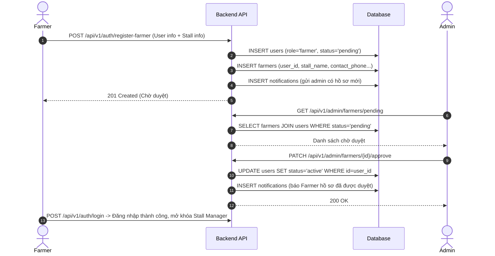
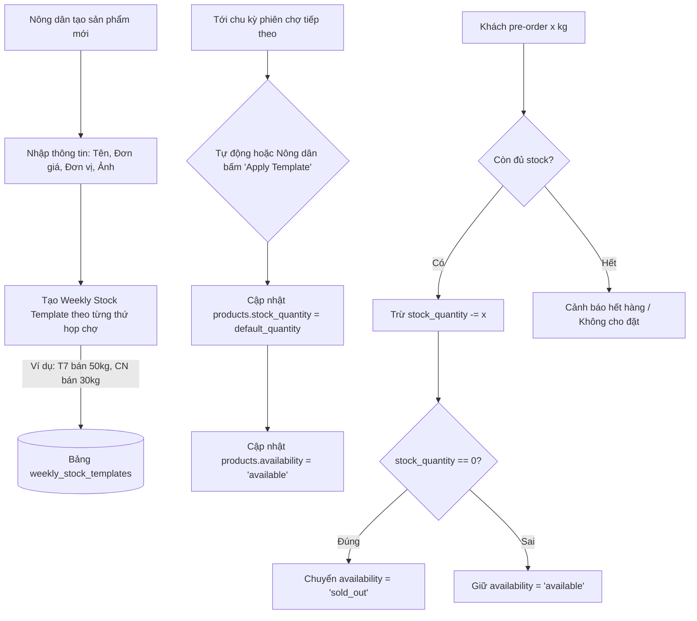
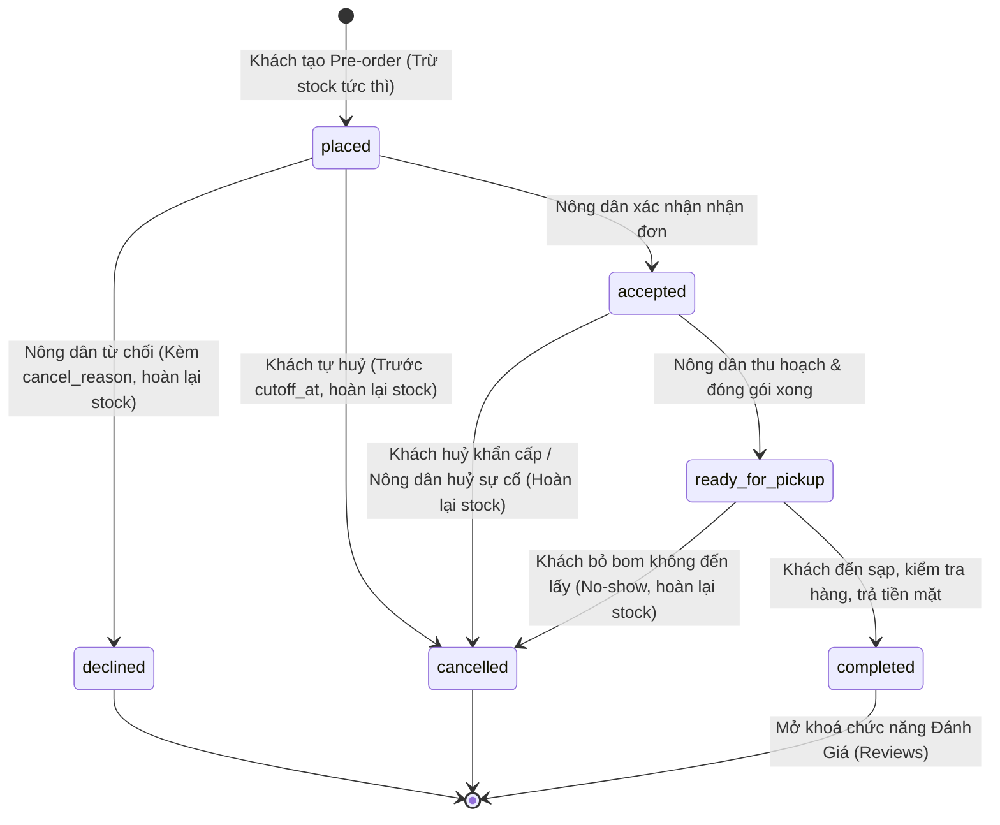
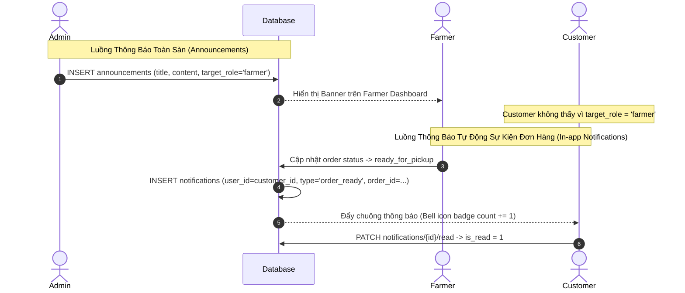

# QUY TRÌNH NGHIỆP VỤ HỆ THỐNG (SYSTEM WORKFLOWS)
# DỰ ÁN: MARKETLINK - EGREEN BASKET PORTAL
# KIẾN TRÚC CSDL: 17 BẢNG CHUẨN HOÁ (LARAVEL REST API + REACT SPA)

Tài liệu này đặc tả toàn bộ quy trình nghiệp vụ (Business Workflows), luồng dữ liệu (Data Flow), cỗ máy trạng thái (State Machines) và logic tính toán tự động dựa trên cấu trúc 17 bảng Cơ sở dữ liệu chuẩn hóa của dự án **MarketLink**.

---

## 1. TỔNG QUAN PHÂN QUYỀN & ACTORS (3 ROLES)

```mermaid
graph TD
    classDef admin fill:#DC2626,stroke:#991B1B,color:#fff;
    classDef farmer fill:#16A34A,stroke:#15803D,color:#fff;
    classDef customer fill:#2563EB,stroke:#1E40AF,color:#fff;
    classDef system fill:#F59E0B,stroke:#D97706,color:#fff;

    Admin[Quản Trị Viên - Admin]:::admin
    Farmer[Chủ Sạp / Nông Dân - Farmer]:::farmer
    Customer[Khách Hàng - Customer]:::customer
    System[Hệ Thống Tự Động - System Scheduler]:::system

    Admin -->|Quản lý| Markets[Danh Bạ Chợ & Lịch Họp]
    Admin -->|Phê duyệt/Khoá| UsersGov[Tài khoản Farmer & Customer]
    Admin -->|Kiểm duyệt| Moderation[Sản phẩm & Đánh giá vi phạm]
    Admin -->|Phát thông báo| Announcements[Hệ thống Announcements]

    Farmer -->|Cấu hình sạp| StallProfile[Hồ Sơ Sạp &farmer_markets]
    Farmer -->|Quản lý kho| WeeklyStock[Sản Phẩm & Weekly Stock Template]
    Farmer -->|Xử lý đơn| OrderProcessing[Duyệt đơn / Chuẩn bị hàng / Sẵn sàng]
    Farmer -->|Phản hồi| ReviewReply[Trả lời Review sản phẩm]

    Customer -->|Khám phá| Browse[Duyệt Chợ, Bản đồ OSM, Tìm Nông Sản]
    Customer -->|Giỏ hàng & Đặt trước| PreOrder[Pre-order giữ chỗ không thanh toán online]
    Customer -->|Theo dõi| OrderTracker[Theo dõi mã đơn & Đến sạp nhận hàng]
    Customer -->|Đánh giá & Lưu| Feedback[Đánh giá 1-5 sao, Lưu Favorites]

    System -->|Tính toán| AutoCutoff[Tính Cutoff Time & Đóng nhận đơn]
    System -->|Thông báo| NotifTrigger[Gửi in-app Notification theo trạng thái]
    System -->|Cập nhật| Aggregations[Tính lại avg_rating & review_count]
```

---

## 2. QUY TRÌNH ĐĂNG KÝ, XÁC THỰC & KHỞI TẠO HỒ SƠ

### 2.1. Customer Registration & Login Flow
- **Ràng buộc SRS**: Khách hàng khi đăng ký bắt buộc phải cung cấp: `fullname`, `username`, `email`, `password`, `phone`, và `address`.
- **Validation**:
  - `email`: unique trong bảng `users`, đúng định dạng email.
  - `username`: unique trong bảng `users`, chữ và số không dấu.
  - `phone`: định dạng số điện thoại chuẩn (10-15 ký tự).
  - `role`: mặc định gán `customer`.
  - `status`: mặc định `active`.
- Tự động tạo 1 bản ghi giỏ hàng rỗng trong bảng `carts` gắn với `user_id`.

### 2.2. Farmer Registration & Approval Workflow
- Nông dân đăng ký tài khoản với role `farmer`.
- Bắt buộc điền thông tin sạp ban đầu: `stall_name`, `contact_person`, `contact_phone`, `address`.
- **Luồng phê duyệt**:
  1. Tài khoản User tạo với `role = 'farmer'`, `status = 'pending'`.
  2. Tạo bản ghi `farmers` với `user_id`, `avg_rating = 0.00`, `review_count = 0`.
  3. Admin truy cập Admin Portal kiểm tra thông tin nông dân:
     - Nếu hợp lệ: Cập nhật `users.status = 'active'`, gửi notification chúc mừng. Nông dân được phép đăng nhập, liên kết với chợ (`farmer_markets`) và đăng sản phẩm (`products`).
     - Nếu từ chối: Cập nhật `users.status = 'inactive'`, gửi email/thông báo lý do từ chối.

---

## 3. QUY TRÌNH QUẢN LÝ SẠP HÀNG & LỊCH NHẬN HÀNG (`farmer_markets`)

Một nông dân có thể bán tại một hoặc nhiều chợ nông sản địa phương. Mỗi liên kết giữa Nông dân và Chợ được định nghĩa tại bảng `farmer_markets`.

### 3.1. Cấu hình Khung Giờ & Slot Nhận Hàng:
- `pickup_days`: Mảng JSON lưu các thứ trong tuần nông dân có mặt giao hàng tại chợ (VD: `[6, 0]` = Thứ 7 & Chủ Nhật). Phải nằm trong danh sách `day_of_week` của `market_schedules`.
- `pickup_start_time` & `pickup_end_time`: Khung giờ mở sạp giao hàng (VD: `08:00:00` đến `12:00:00`).
- `slot_minutes`: Độ dài mỗi ca nhận hàng (Mặc định 30 phút).
  - Ví dụ: Từ 08:00 đến 12:00 chia thành 8 slot: `08:00 - 08:30`, `08:30 - 09:00`, `09:00 - 09:30`, ..., `11:30 - 12:00`.
- `cutoff_hours`: Thời gian chốt đơn tối thiểu trước giờ pickup (Mặc định 12 tiếng).

### 3.2. Thuật toán Sinh Slot Nhận Hàng Khả Dụng (Time Slot Generator):
Khi khách hàng chọn một ngày nhận hàng cụ thể `pickup_date` (ví dụ: ngày 2026-09-27 rơi vào Thứ 7 = day 6):
1. Kiểm tra thứ của ngày đó có nằm trong `farmer_markets.pickup_days` hay không.
2. Lấy `pickup_start_time` và `pickup_end_time`. Chia đều thành các khoảng cách nhau `slot_minutes`.
3. Tính thời điểm chốt đơn của từng slot:
   $$\text{Slot Cutoff Datetime} = \text{pickup\_date} + \text{slot\_start\_time} - \text{cutoff\_hours}$$
4. Nếu $\text{Current Time} \ge \text{Slot Cutoff Datetime}$, slot đó bị vô hiệu hóa (quá giờ chốt đơn).

---

## 4. QUY TRÌNH QUẢN LÝ KHO & ĐỊNH MỨC TUẦN (`weekly_stock_templates`)

Để giảm thiểu việc nông dân phải nhập lại số lượng tồn kho thủ công mỗi tuần, hệ thống hỗ trợ **Mẫu kho hàng tuần (Weekly Stock Templates)**.

---

## 5. QUY TRÌNH ĐẶT TRƯỚC GIỮ CHỖ (PRE-ORDER FOR PICKUP LIFECYCLE)

### 5.1. Ràng buộc quan trọng của Pre-Order:
- **KHÔNG CỔNG THANH TOÁN**: Đơn hàng không thực hiện giao dịch qua Stripe, PayPal hay VNPAY. Toàn bộ tiền được thanh toán trực tiếp tại sạp khi khách đến nhận hàng (`Payment settled in person at pickup`).
- **KHÔNG GIAO HÀNG TẬN NHÀ**: Khách hàng trực tiếp đến chợ và sạp tương ứng vào khung giờ đã hẹn.
- **Tách Đơn Tự Động theo Sạp (Split Order by Farmer & Market)**: Trong giỏ hàng `carts`, khách hàng có thể thêm sản phẩm từ nhiều nông dân khác nhau. Khi bấm Checkout:
  - Hệ thống tự động gom nhóm các item theo cặp `(farmer_id, market_id)`.
  - Mỗi nhóm sẽ tạo thành **1 Đơn Hàng Độc Lập** trong bảng `orders` với mã `order_code` riêng (VD: `ML-2026-F01-8891`).
  - Mỗi đơn hàng lưu ảnh chụp giá (`snapshot`) tại `order_items` để đảm bảo tính bất biến nếu sau này sản phẩm đổi giá.

### 5.2. Cỗ Máy Trạng Thái Đơn Hàng (Order State Machine):

### 5.3. Chi tiết các bước và mốc thời gian (Timestamps Tracking):
| Trạng thái | Điều kiện chuyển | Cập nhật DB | Thông báo In-app |
| :--- | :--- | :--- | :--- |
| `placed` | Khách checkout giỏ hàng thành công | `cutoff_at` được tính tự động, trừ `products.stock_quantity` | Gửi Farmer: *"Bạn có đơn pre-order mới #{order_code}"* |
| `accepted` | Farmer duyệt đơn | Set `accepted_at = NOW()` | Gửi Customer: *"Đơn hàng #{order_code} đã được nông dân tiếp nhận"* |
| `declined` | Farmer hết hàng đột xuất / bận | Set `cancelled_at = NOW()`, điền `cancel_reason`, cộng hoàn trả `stock_quantity` | Gửi Customer: *"Đơn #{order_code} bị từ chối: {reason}"* |
| `ready_for_pickup`| Hàng đã bó sẵn để tại sạp | Set `ready_at = NOW()` | Gửi Customer: *"Nông sản của bạn đã sẵn sàng tại gian hàng {stall_location}"* |
| `completed` | Khách nhận hàng và trả tiền mặt | Set `completed_at = NOW()` | Gửi Customer: *"Cảm ơn bạn! Hãy để lại đánh giá cho sạp"* |
| `cancelled` | Huỷ bởi khách (trước cutoff) | Set `cancelled_at = NOW()`, cộng hoàn trả `stock_quantity` | Báo đối phương đơn đã huỷ |

---

## 6. QUY TRÌNH ĐÁNH GIÁ & PHẢN HỒI (REVIEWS & RATINGS)

### 6.1. Quy tắc Nghiệp Vụ Theo Đề Bài SRS:
1. **Chỉ đánh giá sau khi hoàn thành**: Khách hàng chỉ được đánh giá các đơn có trạng thái `completed`.
2. **Đối tượng đánh giá (Exclusive OR)**:
   - Một đánh giá thuộc về **Nông dân** (`farmer_id IS NOT NULL, product_id IS NULL`).
   - HOẶC thuộc về **Sản phẩm cụ thể** (`product_id IS NOT NULL, farmer_id IS NULL`).
   - Ràng buộc DB: `CHECK ((farmer_id IS NULL) <> (product_id IS NULL))`.
3. **Phản hồi từ Nông dân (Farmer Reply)**:
   - Theo SRS Mục 1.6: *"Farmers can view and optionally respond to customer reviews left on their products"*.
   - Do đó, cột `farmer_reply` và `farmer_replied_at` chỉ áp dụng cho đánh giá loại `product`.
4. **Tự Động Tính Trung Bình Sao (Aggregation Update)**:
   - Khi có review mới hoặc review bị ẩn bởi Admin:
   - Tính lại `avg_rating = ROUND(AVG(rating), 2)` và `review_count = COUNT(id)` trên bảng `products` hoặc `farmers`.
5. **Kiểm Duyệt Của Admin (Content Moderation)**:
   - Admin có thể chuyển cờ `is_hidden = 1` đối với những bình luận khiếm nhã, sai sự thật.
   - Khi `is_hidden = 1`, review không hiển thị trên giao diện công khai và bị loại khỏi tính toán trung bình sao.

---

## 7. QUY TRÌNH TƯƠNG TÁC THÔNG BÁO & ANNOUNCEMENTS

---

## 8. QUY TRÌNH DUYỆT BẢN ĐỒ & TÌM KIẾM ĐỊNH VỊ (MAP DISCOVERY)

1. **Khách hàng mở trang Chợ Nông Sản (Markets Directory)**:
   - Hệ thống hiển thị bản đồ tích hợp (OpenStreetMap Leaflet hoặc Google Maps Embed).
   - Truy vấn `markets` kèm `market_schedules` có `status = 'active'`.
   - Ghim các Marker vị trí chợ dựa trên `latitude` và `longitude`.
2. **Khách hàng chọn một chợ cụ thể**:
   - Hiển thị danh sách các Sạp Nông Dân (`farmers`) đang hoạt động tại chợ đó (thông qua bảng `farmer_markets`).
   - Hiển thị vị trí sạp cụ thể trong chợ (`stall_location`, ví dụ: *Khu A, Gian số 05*).
   - Cung cấp nút định vị chỉ đường (Directions) mở tọa độ trên OpenStreetMap / Google Maps.

---

## 9. QUY TẮC RÀNG BUỘC KỸ THUẬT & TOÀN VẸN DỮ LIỆU (DATA INTEGRITY CHECKS)

| Bảng | Ràng buộc nghiệp vụ | Xử lý vi phạm |
| :--- | :--- | :--- |
| `users` | Khách hàng bắt buộc đủ `phone`, `address` | Chặn tại `StoreRegisterRequest` (HTTP 422) |
| `farmer_markets` | Không trùng lặp 1 farmer đăng ký 2 lần tại 1 chợ | UNIQUE `(farmer_id, market_id)` |
| `market_schedules`| Giờ mở cửa phải trước giờ đóng cửa | CHECK `open_time < close_time` |
| `products` | Giá bán và tồn kho không được âm | CHECK `price >= 0` và `stock_quantity >= 0` |
| `weekly_stock_templates` | Không trùng lặp thứ trong tuần cho 1 sản phẩm | UNIQUE `(product_id, day_of_week)` |
| `cart_items` | Một sản phẩm chỉ xuất hiện 1 dòng trong giỏ | UNIQUE `(cart_id, product_id)`, tăng `quantity` nếu thêm tiếp |
| `orders` | Không đặt đơn khi đã quá giờ cutoff | Check logic server: nếu `NOW() >= cutoff_at` trả HTTP 422 |
| `orders` | Snapshot thông tin sản phẩm | Copy nguyên `name`, `unit`, `price` vào `order_items` |
| `reviews` | Chỉ review đúng 1 đối tượng (hoặc Farmer hoặc Product) | DB CHECK `(farmer_id IS NULL) <> (product_id IS NULL)` |
